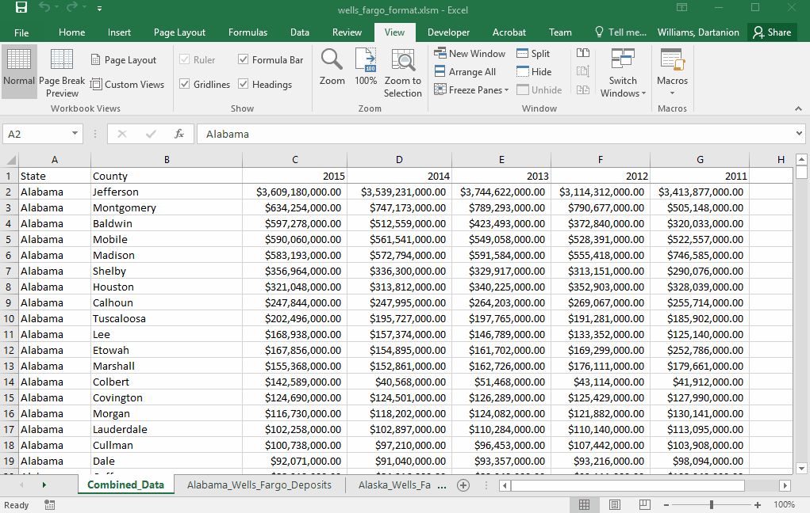

# Wells Fargo - Combining Data

* For this Homework task you will be combining all of your previous Excel sheets into one massive table on a new sheet.

* Call the new sheet `Combined_Data`

**Instructions**

* Using the starter code, develop a macro that will loop through every worksheet and select the contents of each worksheet (State, County, and the data for each of the years)

* Copy all of the financial data from each the individual sheets and load into Combined_Data tab

* When you have completed this task, there should be one large table that represents the financial data for each state and county and for years 2011 - 2015 (where the data is available)

An example of the desired output is below:

